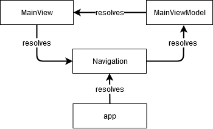
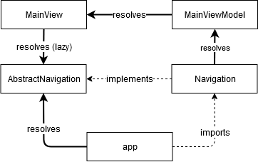

---
---
# Dependency Injection

A complete example Tabris.js application that uses data dependency injection can be found [here](https://github.com/eclipsesource/tabris-js-reddit-viewer).

## Introduction

Tabris provides a [decorators](http://www.typescriptlang.org/docs/handbook/decorators.html)-based [dependency injection](https://en.wikipedia.org/wiki/Dependency_injection)  via the `'tabris-decorators'` extension, which has to be installed in addition to the `tabris` module:

```
npm install tabris-decorators
```

 [**This extension works only with TypeScript/JSX projects**](../typescript.md#setup). Mixed projects work as well, but the modules using the extension need to be `.ts` or `.tsx` files. It's strongly recommended to familiarize yourself with the [basic decorators syntax](https://www.typescriptlang.org/docs/handbook/decorators.html#class-decorators) if you aren't already.

## Basic Principles

The core idea behind dependency injection is that any object (the "client") that needs to interact with another object (the "service") should not be responsible for the creation or management of that other object. Instead it is "injected" by a third party. For Tabris.js this "third party" can be the  [`Injector`](./Injector.md) provided by `tabris-decorators`.

Most of the time there is no need to interact with the injector directly. Instead, decorators can be used to both [register classes](./@injectable.md) for injection and to [inject them](./@inject.md) via a constructor parameter. However, the initial object of any dependency tree (usually something that kickstarts the application) always needs to be created [explicitly](./Injector.md#createtype-parameters).


The Tabris dependency injection service is integrated with the [JSX API](../declarative-ui.md). Any class (usually custom UI components) that is instantiated vis JSX will have its [registered dependencies](./@inject.md) resolved [automatically with no additional code](./@inject.md#jsx).

## The Decorators

The following data binding related decorators are exported by `tabris-decorators`:
  * [@inject](./@inject.md)
  * [@injectable](./@injectable.md)
  * [@shared](./@shared.md)
  * [@injectionHandler](./@injectionHandler.md)

## Dealing with circular dependencies

In a sufficiently complex application you may eventually create circular injection dependencies causing errors. One way to resolve them is to re-structure you code, which is usually the best approach. If this is not possible, there are indeed ways to make circular dependencies work.

Consider a scenario with the following classes:



Assuming you are using the `@inject` decorator on constructor parameters to resolve the dependencies this will definitely not work. To fix this you need to break the module dependency chain and/or resolve one of the modules "lazily".

The goal is an architecture like this:



The specific approach depends on what error(s) you are getting:

### Circular Module Dependencies

If you are getting errors mentioning "circular module dependencies" you must break the module import chain by splitting one of the classes in to an abstract class and a concrete class. So instead of this:

```ts
@shared
export class Navigation {
  navigateTo(target: Page) {
    // ...
  }
}
```

You must do this:

```ts
export abstract class AbstractNavigation {
  abstract navigateTo(target: Page): void;
}
```

And then *in a separate module* this:

```ts
@shared
export class Navigation extends AbstractNavigation {
  navigateTo(target: Page) {
    // ...
  }
}
```

> Note: The class names here are chosen for clarity, you may call these whatever you want. Even identical class names will work since you can rename classes on import.

Now you can use the abstract class to resolve any dependencies to the concrete class. Since there may now be no explicit dependency on the concrete class anymore you need to import it in your app module. Make sure you do this *before*  any module that will inject it:

```ts
import {resolve} from 'tabris-decorators';
import './Navigation';
import {AbstractNavigation} from './AbstractNavigation';
import {MainView} from './MainView';

resolve(AbstractNavigation).navigateTo(resolve(MainView));
```

### Circular Dependency Injection

You may still be getting "Circular dependency injection" errors. This is the case if every class in the injection chain resolves the next class immediately on creation, e.g. when injected via constructor parameter:

```ts
@injectable
export class MainViewModel {

  constructor(@inject navigation: AbstractNavigation) {
    // ...
  }

}
```

To avoid this you have to "lazy" resolve the next class *outside* the constructor. This can be done in two ways:

1: Use [`resolve`](./Injector.md#resolvetype-injectionparameter) in a method *not* called in the constructor, e.g.:

```ts
@injectable
export class MainViewModel {

  select() {
    const navigation = resolve(AbstractNavigation);
    navigation.navigateTo(new MyPage());
  }

}
```

2: Inject the next class in a property that is *not* accessed in the constructor:

```ts
@injectable
export class MainViewModel {

  @inject navigation: AbstractNavigation;

  select() {
    this.navigation.navigateTo(new MyPage());
  }

}
```
